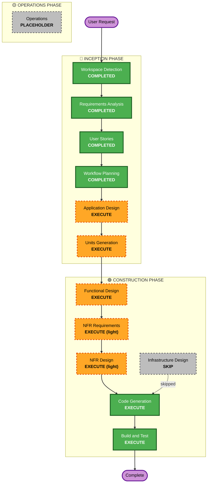

# Execution Plan — 蛙游记 Froggy Trails (v1)

## Detailed Analysis Summary

### Change Impact Assessment
- **User-facing changes**: Yes — 全部为面向用户的全新功能。
- **Structural changes**: Yes — 从零建立前端架构(状态机、领域引擎、本地持久化、UI)。
- **Data model changes**: Yes — 新建本地数据模型(按 PRD §21,落在 IndexedDB)。
- **API changes**: No — v1 无后端 API(纯前端 + 本地存储)。
- **NFR impact**: Yes — 离线可玩、seed 确定性、无障碍/减少动效、性能、视觉一致性。

### Risk Assessment
- **Risk Level**: Medium — 无生产/数据破坏风险(纯本地前端),但异步惰性结算 + 可复现 seed 是有一定复杂度的核心逻辑。
- **Rollback Complexity**: Easy(greenfield,版本控制即可回退)。
- **Testing Complexity**: Moderate — 领域引擎(目的地评分、惰性推进、seed 复现)需单元测试。

## Workflow Visualization

文本回退:Workspace Detection→Requirements→User Stories→Workflow Planning(均已完成)→Application Design(执行)→Units Generation(执行)→Functional Design(执行)→NFR Requirements/Design(轻量执行)→Infrastructure Design(跳过)→Code Generation(执行)→Build and Test(执行)。

## Phases to Execute

### 🔵 INCEPTION PHASE
- [x] Workspace Detection (COMPLETED)
- [x] Reverse Engineering (SKIPPED — greenfield)
- [x] Requirements Analysis (COMPLETED)
- [x] User Stories (COMPLETED)
- [x] Workflow Planning (COMPLETED)
- [ ] Application Design — **EXECUTE**
  - **Rationale**: 全新系统,需要识别组件、服务层、组件依赖与数据模型。
- [ ] Units Generation — **EXECUTE**
  - **Rationale**: 需要把 28 个故事组织成可开发的逻辑模块;v1 为单一前端部署单元 + 逻辑模块划分。

### 🟢 CONSTRUCTION PHASE
- [ ] Functional Design — **EXECUTE**
  - **Rationale**: 旅行引擎(目的地评分、惰性推进、seed 复现、庭院经济)含真实业务逻辑,需详细设计。
- [ ] NFR Requirements — **EXECUTE (light)**
  - **Rationale**: NFR 已在 requirements.md 明确,此处轻量固化技术栈与指标即可。
- [ ] NFR Design — **EXECUTE (light)**
  - **Rationale**: 将离线/确定性/无障碍/性能落到具体模式。
- [ ] Infrastructure Design — **SKIP**
  - **Rationale**: v1 无后端/云资源,纯静态前端(Vercel/静态托管),无需基础设施设计。
- [ ] Code Generation — **EXECUTE (ALWAYS)**
  - **Rationale**: 实现可运行的 Next.js 应用,跑通核心闭环。
- [ ] Build and Test — **EXECUTE (ALWAYS)**
  - **Rationale**: 安装依赖、构建、单元测试领域引擎、验证闭环。

### 🟡 OPERATIONS PHASE
- [ ] Operations — PLACEHOLDER

## Estimated Timeline
- **Total Stages to Execute (remaining)**: 7(AD, UG, FD, NFR-R, NFR-D, CG, BT)
- **Mode**: 端到端自主执行(用户已授权跳过逐关审批)。

## Success Criteria
- **Primary Goal**: 一个可运行的 Next.js Web 应用,跑通完整核心闭环(选角色→准备→出发→惰性等待→收明信片→归来→点亮地图/相册)。
- **Key Deliverables**: 可 `npm run build` 通过的应用;领域引擎单元测试通过;8–12 个种子地点内容;中英双语;桌面优先响应式。
- **Quality Gates**: 类型检查/构建通过;领域引擎测试(seed 复现、目的地评分、惰性推进)通过;核心闭环可手动走通。
