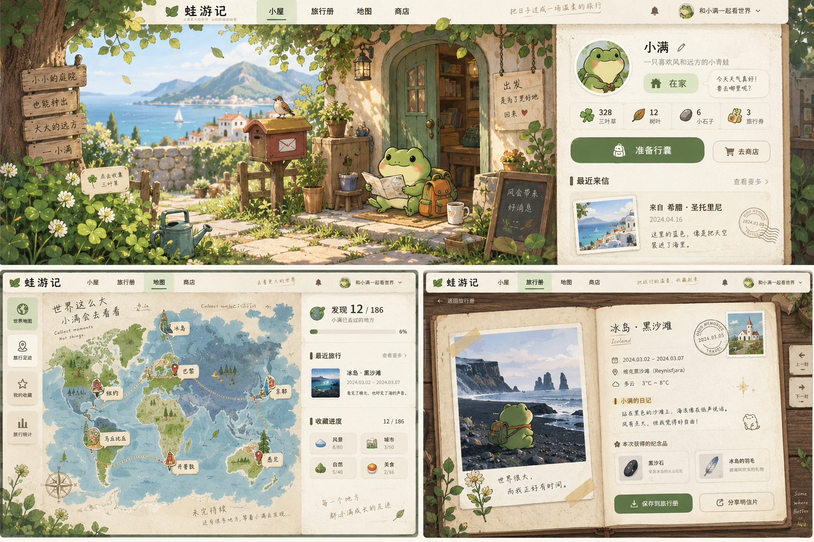

# 蛙游记 Froggy Trails — Web 产品 PRD

> 一个受“旅行小动物 + 异步等待 + 明信片收集”启发的原创 Web 产品。  
> 核心不是让用户控制旅行，而是让用户“准备，然后等待它替你看看世界”。

---

## 0. 产品概览

**产品名称（暂定）**：蛙游记 Froggy Trails  
**产品形态**：Responsive Web + PWA  
**核心体验**：低操作、异步等待、真实世界旅行、收藏、陪伴感  
**核心用户**：18–35 岁上班族、学生、旅行爱好者、Cozy Game 用户、收藏型用户

### 一句话定位

养一只会独自旅行的小蛙。你只负责替它收拾行囊，它会去真实世界里的某个地方，并偶尔给你寄回来一张明信片。

### 核心情绪

> 我没有时间去远方，但有一个小家伙正在替我看看世界。

---

## 1. 产品目标

### 1.1 目标

1. 建立一个“低压力、低操作”的长期陪伴型 Web 产品。
2. 将真实世界地点、天气、城市知识融入旅行结果。
3. 让用户通过明信片、纪念品和地图形成长期收藏动力。
4. 保持“不可完全控制”的旅行随机性。
5. 让结果天然适合分享，而不是构建复杂社交系统。

### 1.2 非目标

第一阶段不做：

- 即时操控角色
- 实时导航
- 重任务系统
- 强竞技
- 强社交
- 高频签到
- 重抽卡
- 强制广告
- 付费缩短等待

---

## 2. 用户画像

| 用户类型 | 使用场景 | 核心需求 |
|---|---|---|
| 上班族 / 学生 | 工作学习间隙 | 快速放松，不需要持续操作 |
| 喜欢旅行但没时间的人 | 通勤 / 睡前 | 获得“替我旅行”的想象 |
| Cozy / 放置游戏用户 | 碎片时间 | 陪伴、等待、惊喜 |
| 收藏型用户 | 长期使用 | 收集地点、纪念品、邮票、明信片 |
| 分享型用户 | 收到稀有内容 | 生成好看的分享卡 |

### 2.1 JTBD

> 当我很忙、又想获得一点“远方感”时，我希望只做一个很小的动作，然后让小蛙自己去探索；等我再次打开网页时，有东西在等我。

---

## 3. 核心产品原则

### 3.1 不直接控制目的地

用户不能直接选择：

> 去巴黎

而是通过：

- 食物
- 护符
- 装备
- 季节
- 随机因素

去影响目的地概率。

### 3.2 等待是真实玩法的一部分

建议旅行时长：

- 新手首趟：3–8 分钟
- 普通旅行：30 分钟–8 小时
- 远行：8–24 小时
- 稀有远行：1–3 天

### 3.3 回来必须有反馈

一次旅行至少产出以下三类内容中的两类：

- 故事
- 地点
- 收藏

---

## 4. 核心循环

```text
收集资源
   ↓
准备行囊
   ↓
小蛙自主出发
   ↓
等待
   ↓
收到明信片 / 旅行事件
   ↓
小蛙归来
   ↓
获得纪念品 / 地点知识
   ↓
地图点亮 / 收藏成长
   ↓
再次出发
```

---

## 5. 信息架构

```text
蛙游记
├── 小屋 Home
│   ├── 庭院
│   ├── 小蛙状态
│   ├── 邮箱
│   └── 出发入口
│
├── 行囊 Backpack
│   ├── 食物
│   ├── 护符
│   ├── 装备
│   └── 行程倾向
│
├── 世界地图 Map
│   ├── 已访问地区
│   ├── 未解锁迷雾
│   ├── 地点百科
│   └── 旅行路线
│
├── 旅行册 Album
│   ├── 明信片
│   ├── 邮票
│   ├── 纪念品
│   └── 成就
│
├── 商店 Shop
│   ├── 食物
│   ├── 装备
│   └── 装饰
│
└── 我的
    ├── 小蛙档案
    ├── 设置
    ├── 通知
    └── 数据与版权
```

---

## 6. 首页 / 小屋

这是整个产品最重要的页面。

### 6.1 桌面端布局

左侧约 65%：

- 庭院
- 小屋
- 小蛙
- 邮箱
- 三叶草
- 场景动效

右侧约 35%：

- 小蛙名字
- 心情
- 当前状态
- 当前资源
- 准备行囊按钮
- 最近一张明信片
- 未读邮件
- 季节 / 天气氛围

### 6.2 庭院互动

庭院周期性生成：

- 普通三叶草：基础软货币
- 四叶草：低概率幸运道具
- 露珠：季节货币 / 装饰资源

设计原则：

- 不连续上线也不能产生损失
- 不做高频收菜压力
- 一次滑动即可收取
- 不出现“过期”

---

## 7. 小蛙状态机

```text
HOME_IDLE
   ↓
PACK_READY
   ↓
DEPARTING
   ↓
TRAVELING
   ↓
RETURNING
   ↓
HOME_IDLE
```

旅行途中不展示实时 GPS。

仅展示氛围型状态，例如：

> 小蛙正在向很远的地方走去。

> 背包似乎越来越轻了。

> 今天似乎遇到了雨。

这样保留未知感。

---

## 8. 行囊系统

### 8.1 行李槽位

| 槽位 | 示例 | 主要影响 |
|---|---|---|
| 食物 | 果酱面包、饭团 | 旅行时长、区域偏好 |
| 护符 | 四叶草、小铃铛 | 稀有事件概率 |
| 装备 A | 帐篷、围巾 | 地形与气候 |
| 装备 B | 水壶、相机 | 明信片 / 纪念品 |

### 8.2 模糊提示

用户不直接看到目标地点。

例如：

- 似乎适合寒冷地区
- 也许会走得更远
- 适合喜欢拍照的小蛙
- 雨天也能安心一些

---

## 9. 旅行生成系统

### 9.1 目的地结构

```text
Destination
- id
- country
- region
- city
- latitude
- longitude
- climate
- terrain
- season
- rarity
- distanceTier
- requiredTags
- preferredTags
- postcardPool
- souvenirPool
```

### 9.2 目的地概率

```text
DestinationScore =
BaseWeight
× EquipmentMatch
× FoodMatch
× SeasonMatch
× NoveltyBoost
× RarityFactor
× RandomFactor
```

### 9.3 NoveltyBoost

如果用户连续访问同一国家或区域：

- 未访问区域获得轻度概率提升
- 但不完全阻止重复旅行

重复旅行依然有价值。

同一地点可以根据：

```text
地点
× 季节
× 天气
× 同行角色
× 稀有事件
```

产生不同内容。

---

## 10. 真实世界数据

### 10.1 地图

推荐：

- OpenStreetMap 数据
- MapLibre 渲染
- 商业环境使用合规 Tile Provider 或自建 Tile Service

### 10.2 地点知识

推荐：

- Wikidata
- Wikipedia
- Wikivoyage

用于：

- 国家
- 城市
- 地标
- 经纬度
- 基础介绍
- 别名
- 城市知识

### 10.3 天气

可考虑：

- Open-Meteo
- 或其他商业天气 API

天气主要用于：

- 旅行事件
- 明信片氛围
- 季节表现

### 10.4 图片策略

推荐：

**地图 / 地名 / 天气：真实数据**

**明信片画面：原创插画或 AI 生成插画**

这样可以：

- 保留真实世界旅行感
- 避免产品变成旅游网站
- 更容易形成统一视觉
- 降低版权风险

---

## 11. 明信片系统

### 11.1 生成规则

旅行期间：

- 0–2 张明信片

回家：

- 0–1 张补充明信片

### 11.2 数据结构

```text
Postcard
- postcardId
- tripId
- destinationId
- scene
- frogPose
- companions[]
- weather
- generatedAt
- rarity
- diaryText
- imageUrl
```

### 11.3 稀有度表现

不使用 SSR / 抽卡等语言。

使用：

- 普通纸张
- 烫金边框
- 特殊邮戳
- 星空纸
- 手绘签名
- 限定季节纸张

---

## 12. 旅行相册

相册不建议设计成普通 Grid。

推荐设计成：

> 旅行手帐 / Scrapbook

左页：

- 大尺寸明信片

右页：

- 日期
- 地点
- 天气
- 邮戳
- 小蛙日记
- 纪念品
- 地点知识

### 12.1 分享卡

推荐格式：

```text
「小蛙今天去了 Reykjavík」

2026 / 09 / 10

“风把我的围巾吹成了一面旗子。”

蛙游记
```

分享卡只保留：

- 画面
- 地名
- 日期
- 一句话
- 品牌角标

---

## 13. 世界地图

地图不是规划工具，而是回顾工具。

核心逻辑：

> 不是“我要去哪里”，而是“它去过哪里”。

### 13.1 地图层级

```text
世界
↓
国家
↓
城市 / 景点
```

### 13.2 地点状态

- 未发现
- 听说过
- 去过
- 多次到访
- 完成收藏

初始地图可覆盖轻度迷雾。

访问后逐渐点亮。

---

## 14. 纪念品系统

每个地点建议配置：

3–8 个纪念品。

示例：京都

- 小狐狸挂件
- 木制茶匙
- 一枚旧车票
- 红色布袋
- 一块普通石头

纪念品不必全部是现实商品。

一些“无意义但有情绪”的东西反而更有记忆点。

---

## 15. 朋友来访

P1 功能。

小蛙外出期间可能有访客来到庭院：

- 蜗牛邮差
- 小刺猬
- 麻雀
- 小水獭

用户可以送给它们：

- 食物
- 小礼物

随后可能获得：

- 感谢信
- 纪念物
- 特殊情报
- 下一趟旅行概率影响

---

## 16. 新手流程

### Step 1：见到小蛙

文案：

> 它好像准备出去看看。

用户输入名字。

### Step 2：获得新手道具

- 一块面包
- 一个水壶
- 20 三叶草

### Step 3：准备行囊

用户拖入背包。

### Step 4：第一次出发

首趟控制在：

**3–8 分钟**

确保用户首次会话就能看到完整闭环。

---

## 17. 登录与存档

### 17.1 默认游客模式

优先使用：

- LocalStorage
- IndexedDB

避免第一屏强制登录。

### 17.2 登录触发

例如用户第一次收到稀有明信片时提示：

> 登录后可以保存小蛙的旅行记录。

支持：

- Email Magic Link
- Google
- Apple

---

## 18. PWA 与通知

Web 长期留存很依赖 PWA。

建议通知事件：

- 小蛙回家
- 收到明信片
- 朋友来访

通知文案应保持故事感。

例如：

> “我找到一个很高的地方。”  
> 小蛙寄来了一张明信片。

---

## 19. 商业化

### 19.1 推荐

装饰类：

- 小屋主题
- 背包
- 帽子
- 围巾
- 邮票册
- 相册纸张

Season Pass：

例如：

> 秋日铁路旅行

加入：

- 季节地点
- 限定纪念品
- 特殊明信片
- 特殊访客

### 19.2 不建议

- 强制广告
- 买体力
- 付费立即结束旅行
- 重抽卡
- 高频礼包弹窗

这些会破坏产品最重要的“自然等待”。

---

## 20. MVP 范围

### P0

| 模块 | MVP |
|---|---|
| 小屋 | ✅ |
| 三叶草 | ✅ |
| 小蛙状态 | ✅ |
| 行囊 | ✅ |
| 商店 | ✅ |
| 旅行算法 | ✅ |
| 20–30 个目的地 | ✅ |
| 明信片 | ✅ |
| 纪念品 | ✅ |
| 相册 | ✅ |
| 世界地图 | ✅ |
| 游客存档 | ✅ |
| 云存档 | ✅ |
| 分享图 | ✅ |

### P1

- 朋友来访
- 成就
- 季节系统
- 天气联动
- PWA 推送
- 小屋装饰

### P2

- 多只小蛙
- 好友互访
- 旅行专题
- UGC 明信片
- 真实旅行推荐

---

## 21. 核心数据模型

```text
users
frogs
items
user_inventory
destinations
trips
postcards
souvenirs
user_souvenirs
destination_visits
visitors
notifications
achievements
```

### 21.1 Trips

```text
trip_id
user_id
frog_id
destination_id
departure_at
arrival_at
return_at
food_id
charm_id
gear_1
gear_2
weather_snapshot
random_seed
status
```

建议保存 `random_seed`。

优点：

- 可复现同一次旅行
- 方便 Debug
- 方便客服定位
- AI 内容也可以绑定 seed

---

## 22. 埋点

```text
onboarding_started
onboarding_completed

clover_harvested
shop_item_bought
backpack_item_added
backpack_confirmed

trip_started
postcard_received
postcard_opened
trip_completed

souvenir_received
destination_unlocked

postcard_shared
pwa_installed
notification_enabled
```

---

## 23. 核心指标

### North Star Metric

> 每周完成至少一次“准备 → 旅行 → 收到内容”完整循环的用户数。

### 辅助指标

| 指标 | 目的 |
|---|---|
| D1 / D7 / D30 | 留存 |
| 首次旅行完成率 | 新手体验 |
| Trip / User / Week | 核心循环频次 |
| 明信片打开率 | 内容期待度 |
| 分享率 | 自传播能力 |
| 重复旅行率 | 内容耐玩度 |
| PWA 安装率 | Web 长期留存 |
| 通知授权率 | 召回能力 |

---

## 24. 技术建议

### Frontend

```text
Next.js
React
TypeScript
Tailwind CSS
Framer Motion
```

### Backend

```text
Next.js API / NestJS
PostgreSQL
Redis
```

### Storage

```text
S3 / Cloudflare R2
```

### Map

```text
MapLibre
+ OSM compatible tile provider
```

### Auth

```text
Auth.js
或
Supabase Auth
```

### Analytics

```text
PostHog
```

### Deployment

```text
Vercel
+
Supabase / Neon
```

---

## 25. 视觉设计方向

### 风格关键词

- 森林手帐
- 慢旅行
- 温暖纸张
- 手绘地图
- 轻微复古
- Cozy
- Watercolor

### 配色

```text
纸张米白   #F4EBD8
苔藓绿     #5B7F3B
嫩叶绿     #A7C66B
陶土橙     #C96F4A
阴雨蓝     #6A8EA0
墨色       #2D3A2E
```

### UI 语言

- 18–24px 圆角
- 卡片像明信片 / 纸张
- 极弱阴影
- 轻纸张纹理
- 手绘线条图标
- 避免 SaaS 风
- 避免大量数值和进度条

### 动效

首页：

- 树叶轻微摇动
- 云缓慢移动
- 小蛙偶尔眨眼
- 邮箱来信时轻晃

收到明信片：

不要用普通 Toast。

让明信片像真实卡片一样滑入桌面。

---

## 26. 核心设计决策

### 26.1 不做“青蛙版 Google Maps”

真实世界信息只增强旅行感。

产品核心仍然是：

> 小蛙 + 等待 + 想象 + 收藏

### 26.2 不给用户太多控制权

不可控本身就是体验。

玩家：

- 准备
- 影响
- 等待

但不完全控制。

### 26.3 分享是结果，不是社交系统

MVP 不需要：

- 关注
- 评论
- 私信
- Feed

只要一张：

> “我的蛙今天去了冰岛”

的分享卡足够漂亮。

---

## 27. 首页线框

```text
┌──────────────────────────────────────────────────────────┐
│ 蛙游记                         旅行册   地图   商店   ☘ 128 │
├──────────────────────────────────────┬───────────────────┤
│                                      │  小满              │
│          🌿 庭 院 / 小 屋             │  ● 在家            │
│                                      │                   │
│       🌱     🐸                       │  今天看起来很悠闲   │
│                📮                    │                   │
│                                      │  [ 准备行囊 ]      │
│                                      │                   │
│                                      │ ───────────────   │
│                                      │ 最近来信           │
│                                      │  🇮🇸 一张雨中的照片 │
│                                      │                   │
├──────────────────────────────────────┴───────────────────┤
│    世界已经发现 12 / 186       明信片 38       纪念品 21    │
└──────────────────────────────────────────────────────────┘
```

---

## 28. 第一版内容规模建议

不要一开始做全球几千个 POI。

第一版建议：

**30 个地点**

例如：

- 日本乡间
- 京都
- 冰岛
- 巴黎
- 瑞士山谷
- 撒哈拉
- 挪威峡湾
- 威尼斯
- 布拉格
- 伊斯坦布尔
- 清迈
- 吴哥
- 北京胡同
- 云南
- 香港
- 纽约
- 旧金山
- 秘鲁
- 摩洛哥
- 新西兰

每个地点：

```text
3 张普通明信片
1 张稀有明信片
4 个纪念品
3 条日记
```

30 个地点约等于：

```text
120 张明信片
120 个纪念品
90 条日记
```

已经足够支撑完整 MVP。

---

## 29. IP 与原创边界

正式上线建议：

- 不使用《旅行青蛙》名称
- 不复制原角色造型
- 不复制原房间布局
- 不复制原商店 UI
- 不复制原三叶草视觉
- 不复刻原明信片构图

可以保留的只是产品机制层：

> 自主旅行的小动物  
> + 异步等待  
> + 明信片反馈  
> + 收藏系统

角色、美术、UI、世界观全部原创。

---

# 30. 设计概念图

下面是当前第一版视觉概念图，包含：

1. 小屋首页
2. 世界地图 / 旅行足迹
3. 旅行手帐 / 明信片详情



---

## 31. 下一阶段建议

如果继续进入可开发阶段，建议下一步补齐：

1. **页面级 PRD**
   - Home
   - Backpack
   - Map
   - Album
   - Shop

2. **状态机**
   - Frog State
   - Trip State
   - Postcard State

3. **内容生成规则**
   - 地点选择
   - 明信片生成
   - 日记生成
   - 纪念品生成

4. **数据库 Schema**

5. **API Contract**

6. **前端 Component Tree**

7. **Codex 可直接执行的 Implementation Plan**

---

**文档版本**：v0.1  
**产品阶段**：Concept / MVP Definition  
**日期**：2026-09-10
